# 🎓 Bachelor Thesis: Automated Extraction and Structuring of Relevant Information from Neuroscientific Documents Using Cosine Similarity and Large Language Model (LLM)

## 📑 Table of Contents
- [Introduction](#introduction)
- [System Design](#system-design)
- [File Overview](#file-overview)
- [Results](#results)
- [Tools Used](#tools-used)

## 📘 Introduction
This thesis utilizes cosine similarity and large language model (LLM) with Retrieval Augmented Generation (RAG) to extract information from neuroscientific documents containing information about three electroencephalography (EEG) topics motor imagery, auditory attention, internal- external attention. The aim is to automate structured knowledge extraction from these documents in a faster and more precise way,

## System Design

The following image illustrates the general workflow of the methods:

## File Overview

This repository consists of 4 main files:

1. **compare_similarities.ipynb**
This file contains similarity matrix calculation and comparisons of similarity matrices according to similarity function and embedding model, along with plotting.

2. **llm_rag_information_extraction.py**
This file contains text generation with LLM using RAG and exporting LLM result CSV.

3. results_evaluate.py**
This file contains post-processing of LLM results and pre-processing of Eilts' results. It also applies ranking to both results and calculates correlation coefficients for them.

4. **results_plotting.ipynb**
This file contains plotting LLM results.

**Knowledge Base:** 20 documents per topic in [pdf_documents](./data/pdf_documents) directory.

**Ground Truth:** Ranked results from Eilts' master thesis (Eilts, Hendrik. „Bridging the Gap: Explainable AI Insights Into EEGNet Classification and Its Alignment to Neural Correlates“. Advisor: Dr. Felix Putze; Reviewers: Dr. Felix Putze, Prof. Dr. Marvin Wright. MA thesis. Bremen, Germany: University of Bremen, Cognitive Systems Lab, Mar. 2024.) in [results](./data/results/ground_truth) directory.

---

## Results

### LLMs Comparison

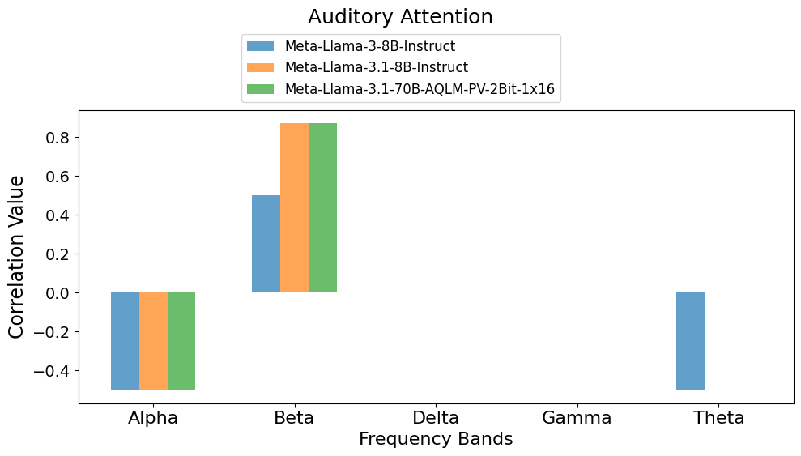

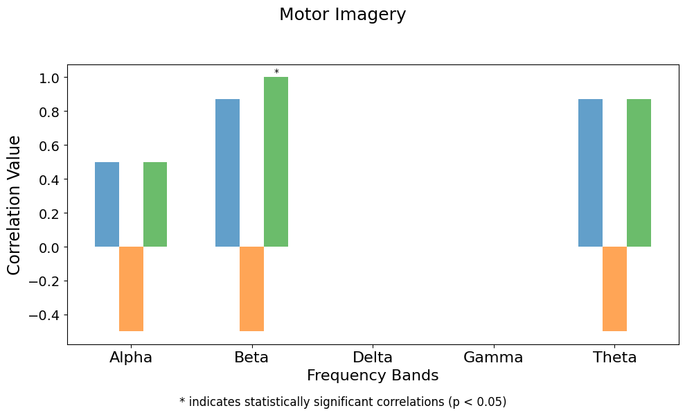

### Chunk Methods & Prompt Strategies

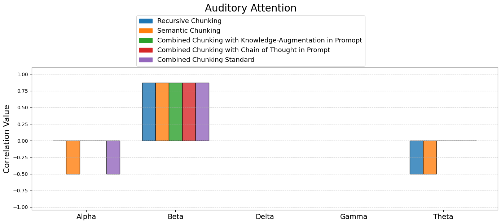

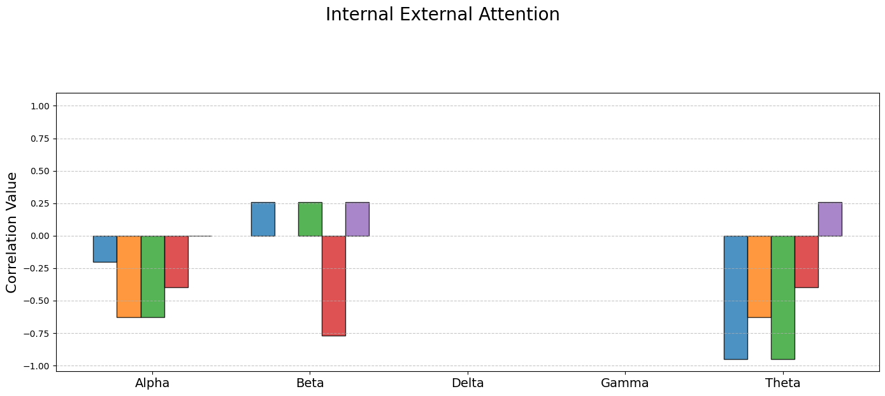

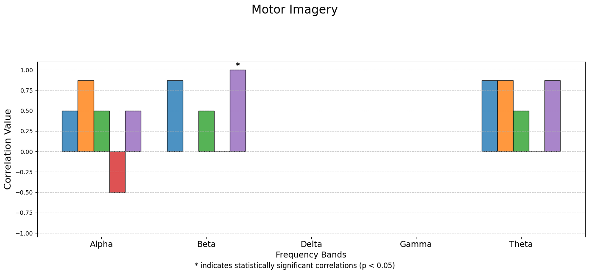

### Chunking Combinations

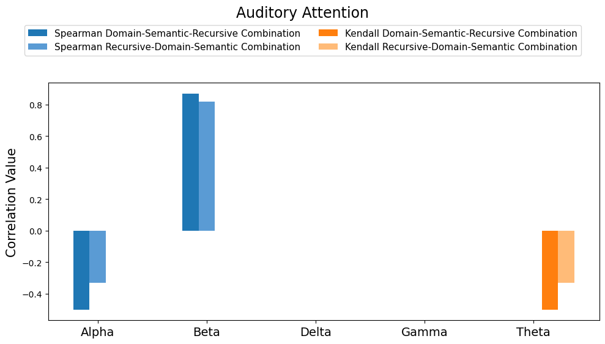

### Removing Bibliography Part From Document

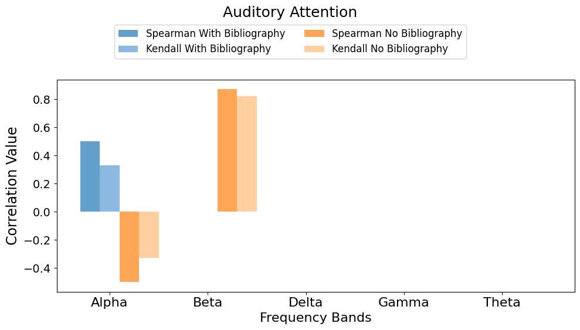

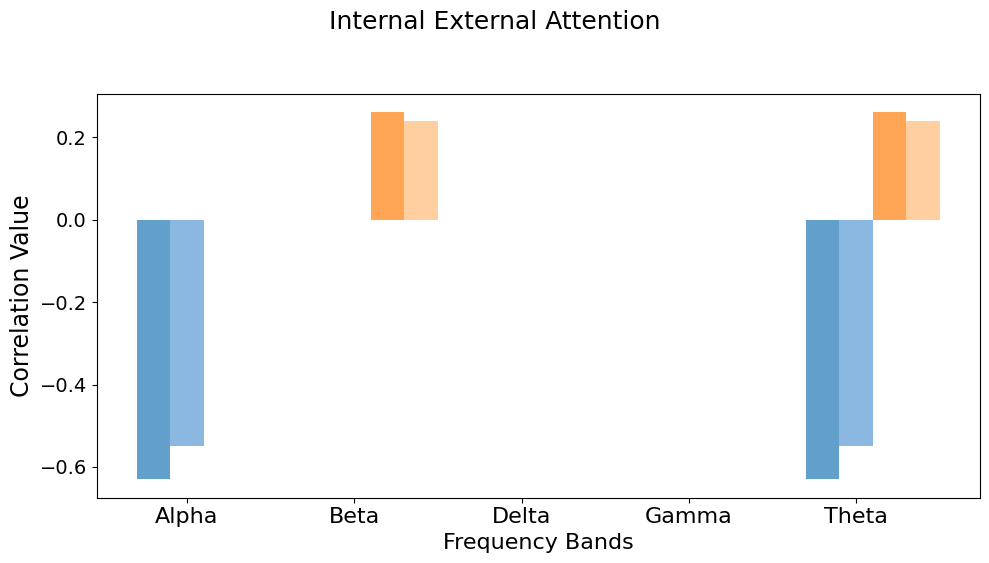

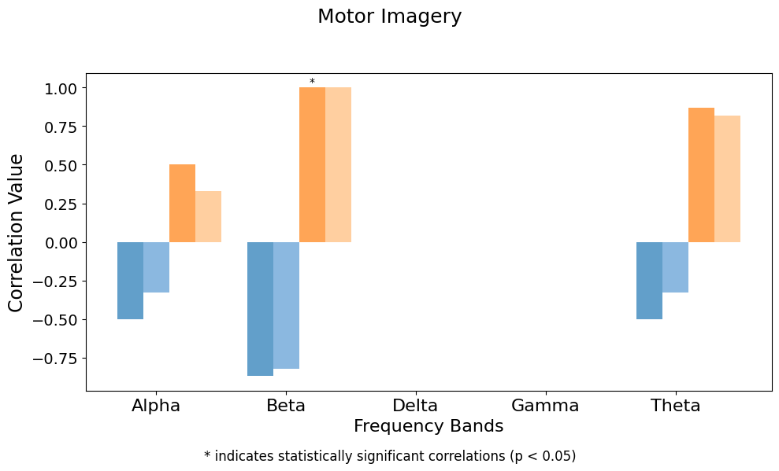

### Chunk & Overlap Size

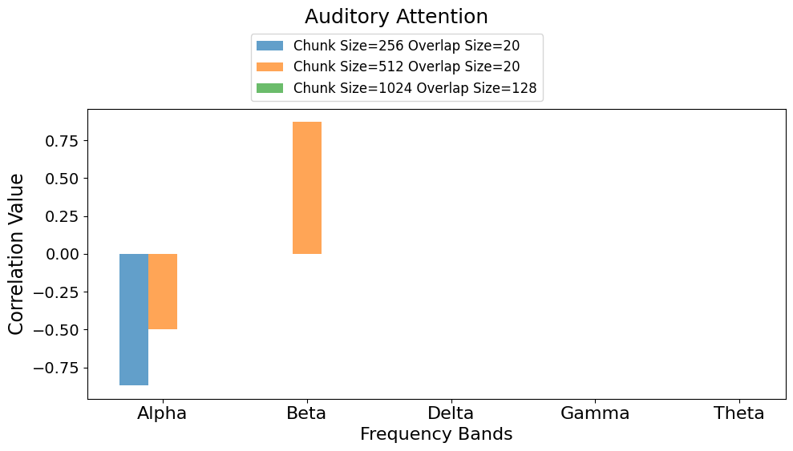

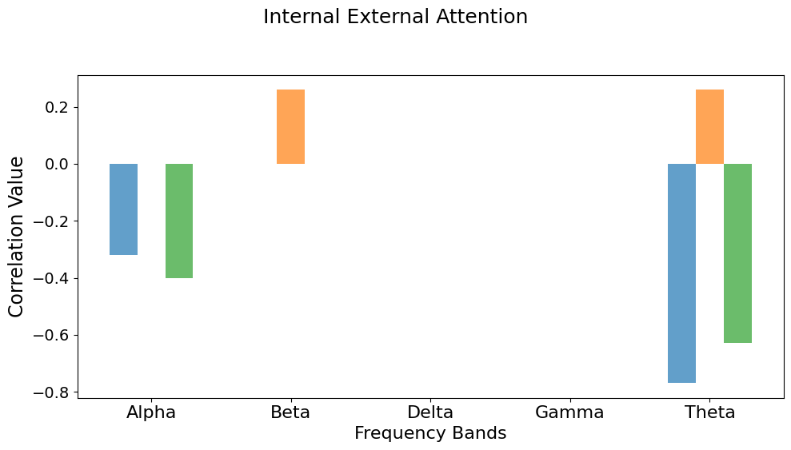

### Repetition Penalty

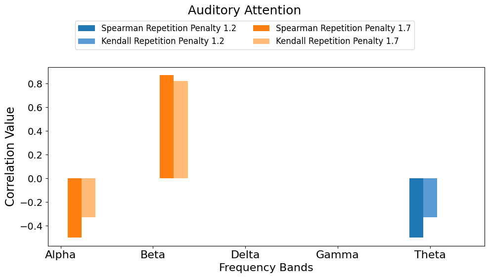

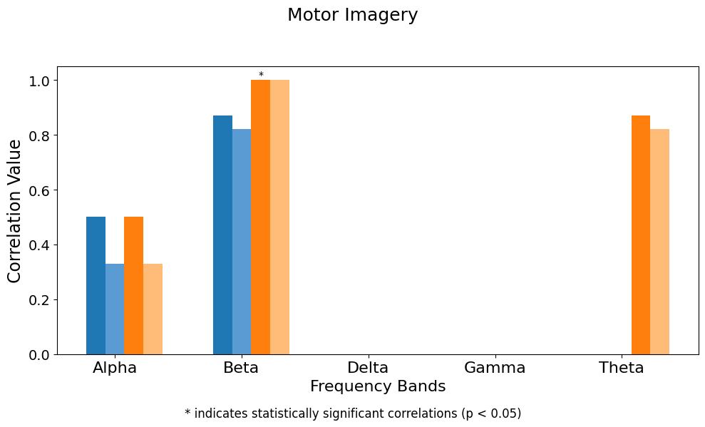

## Tools Used

## Libraries and Frameworks

## Programming Language
- **Python**: Core language for implementation.

### Machine Learning & NLP
- **torch**: Deep learning framework for handling models like Meta-Llama.
- **transformers**: Hugging Face library for model management and text generation.
- **sentence-transformers**: For semantic embeddings (e.g., `all-MiniLM-L6-v2`).
- **LangChain**:
  - Tools: `LLMChain`, `PromptTemplate`, `HuggingFacePipeline`, `PyPDFLoader`, `RecursiveCharacterTextSplitter`.
  - Use Cases: LLM integration, PDF text extraction, and chunking.
- **FAISS**: Vector database for document retrieval and similarity search.

### Statistical Analysis
- **scipy.stats**: Correlation metrics (`spearmanr`, `kendalltau`).
- **numpy**: Numerical computations, including cosine similarity.
- **pandas**: Data analysis and CSV handling.

### Text Processing
- **nltk**: Sentence tokenization for semantic chunking.
- **spaCy**: Preprocessing, lemmatization, and fallback chunking.
- **re**: Regular expressions for text cleaning and processing.

### Data Handling and Filesystem
- **os**, **pathlib**: File and directory management.
- **joblib**: Serialization of models and data.

### Logging
- **logging**: Error tracking and debugging.

## Models and Data
- **Meta-Llama-3.1-70B-AQLM-PV**, **Meta-Llama-3-8B-Instruct**, **Meta-Llama-3.1-8B-Instruct**: LLM for text generation.
- **sentence-transformers/all-MiniLM-L6-v2**: Embedding generation.
- **Datasets**: Neuroscientific PDFs (Motor Imagery, Auditory Attention, IE Attention), Hendrik's XAI Results.

## Integrated Methodologies
- **Semantic Processing**: Domain-specific, recursive, and semantic chunking for text segmentation.
- **Retrieval-Augmented Generation (RAG)**: Combines FAISS-based retrieval with LLMs for enhanced knowledge extraction.
- **Chain-of-Thought Prompting**: Enables structured and logical reasoning in prompts.
- **Knowledge Augmentation**: Injects domain-specific mappings (brain regions, electrode locations) for context precision.
- **Correlation Analysis**: Spearman’s and Kendall’s tau for ranking validation.

## Numerical Operations
- **NumPy**: Vector and matrix computations.
