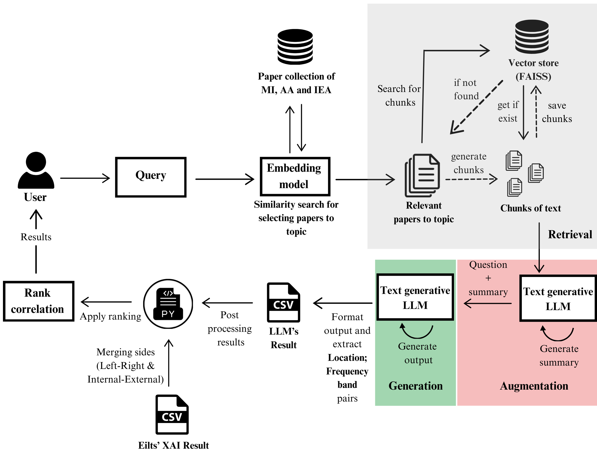

# Automated Extraction and Structuring of Relevant Information from Neuroscientific Documents Using Cosine Similarity and Large Language Model (LLM)

## Overview

This repository consists of 4 main files:

1. **compare_similarities.ipynb **  
This file contains similarity matrix calculation and comprasions of similarity matrices according to similarity function and embedding model and plotting of these.

2. **llm_rag_information_extraction.py **  
This file contains text-generation with LLM using RAG and exporting LLM result csv.

3. **results_evaluate.py **  
This file contains post-processing of LLM result and pre-processing of Eilts' result. It also apply ranking to both results and calculates correlation coefficients of them.

4. **results_plotting.ipynb **  
This file contains plotting LLM results.

* System Design *  

