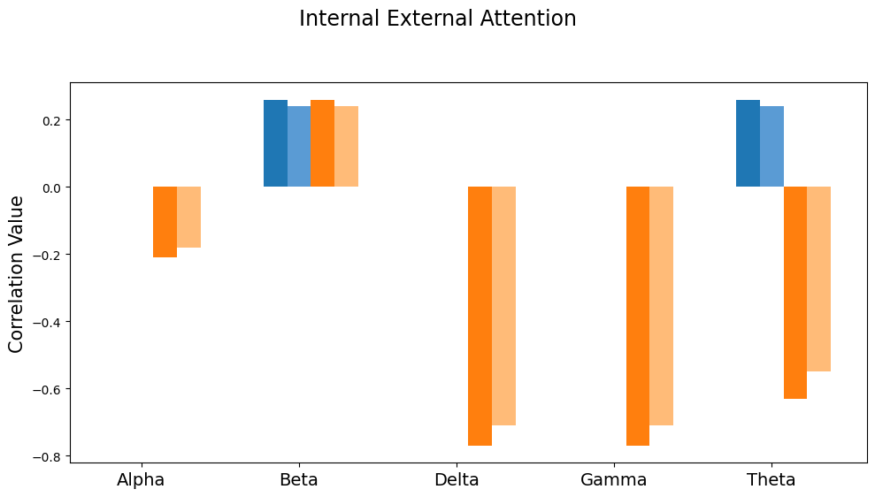
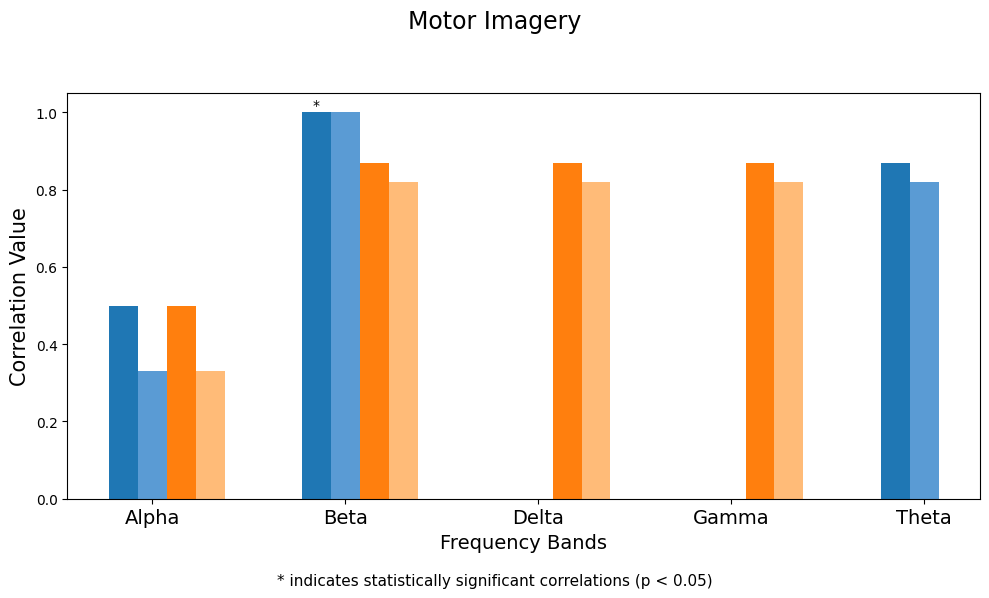
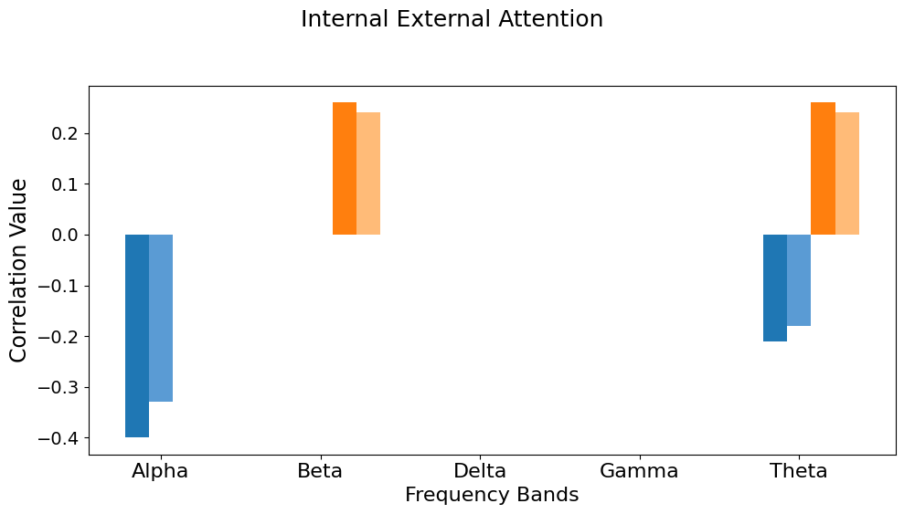

# 🎓 Bachelor Thesis: Automated Extraction and Structuring of Relevant Information from Neuroscientific Documents Using Cosine Similarity and Large Language Model (LLM)

## 📑 Table of Contents
- [Introduction](#introduction)
- [System Design](#system-design)
- [File Overview](#file-overview)
- [Results](#results)
- [Libraries and Frameworks](#libraries-and-frameworks)

---

## 📘 Introduction
This thesis utilizes cosine similarity and large language model (LLM) with Retrieval Augmented Generation (RAG) to extract information from neuroscientific documents containing information about three electroencephalography (EEG) topics motor imagery, auditory attention, internal- external attention. The aim is to automate structured knowledge extraction from these documents in a faster and more precise way.

---

## 🛠️ System Design

The following image illustrates the general workflow of the methods:

---

## 📁 File Overview

This repository consists of 4 main files:

1. **compare_similarities.ipynb**
This file contains similarity matrix calculation and comparisons of similarity matrices according to similarity function and embedding model, along with plotting.

2. **llm_rag_information_extraction.py**
This file contains text generation with LLM using RAG and exporting LLM result CSV.

3. results_evaluate.py**
This file contains post-processing of LLM results and pre-processing of Eilts' results. It also applies ranking to both results and calculates correlation coefficients for them.

4. **results_plotting.ipynb**
This file contains plotting LLM results.

**Knowledge Base:** 20 documents per topic in [pdf_documents](./data/pdf_documents) directory.

**Ground Truth:** Ranked results from Eilts' master thesis (Eilts, Hendrik. „Bridging the Gap: Explainable AI Insights Into EEGNet Classification and Its Alignment to Neural Correlates“. Advisor: Dr. Felix Putze; Reviewers: Dr. Felix Putze, Prof. Dr. Marvin Wright. MA thesis. Bremen, Germany: University of Bremen, Cognitive Systems Lab, Mar. 2024.) in [results](./data/results/ground_truth) directory.

---

## 📊 Results

**LLM Results for having an insight**:  

[View First 10 Rows of Raw LLM-Output](data/results/llm-results/LLM_output.md)  

[View First 10 Rows of Post-Processed LLM-Output](data/results/llm-results/LLM_output_post_processed.md)  

[View Ranked LLM-Result](data/results/llm-results/LLM_ranked_results.json)

### LLMs Comparison

Click to view LLMs comparison results

### Chunk Methods & Prompt Strategies

Click to view Chunk Methods & Prompt Strategies results

### Chunking Combinations

Click to view Chunking Combinations results

### Removing Bibliography Part From Document

Click to view Removing Bibliography results

### Chunk & Overlap Size

Click to view Chunk & Overlap Size results

### Repetition Penalty

Click to view Repetition Penalty results

---

## 📚 Libraries and Frameworks

### Programming Language
- **Python**: Core language for implementation.

### Large Language Model (LLM) & Generative AI Ecosystem
- **torch**: Deep learning framework for handling models like Meta-Llama.
- **transformers**: Hugging Face library for model management and text generation.
- **sentence-transformers**: For semantic embeddings.
- **LangChain**:
  - Tools: `LLMChain`, `PromptTemplate`, `HuggingFacePipeline`, `PyPDFLoader`, `RecursiveCharacterTextSplitter`.
  - Use Cases: LLM integration, PDF text extraction, and chunking.
- **LangGraph**: For advanced visualization of document structures and knowledge graph representations.
- **LangSmith**: For real-time monitoring and debugging of LLM chains and workflows.
- **FAISS**: Vector database for document retrieval and similarity search.

### Statistical Analysis
- **scipy.stats**: Correlation metrics (Spearman’s and Kendall’s tau for ranked correlation.).
- **numpy**: Numerical computations, including cosine similarity.
- **pandas**: Data analysis and CSV handling.

### NLP for Text Processing
- **nltk**: Sentence tokenization for semantic chunking.
- **spaCy**: Preprocessing, lemmatization, and fallback chunking.
- **re**: Regular expressions for text cleaning and processing.

### Models and Data
- **Meta-Llama-3.1-70B-AQLM-PV**, **Meta-Llama-3-8B-Instruct**, **Meta-Llama-3.1-8B-Instruct**: LLM for text generation.
- **all-MiniLM-L6-v2, all-MiniLM-L12-v2, all-mpnet-base-v2, all-distilroberta-v1**: Embedding generation.
- **Datasets**: Neuroscientific PDFs (Motor Imagery, Auditory Attention, IE Attention), Hendrik's XAI Results.

### Integrated LLM Methodologies
- **Retrieval-Augmented Generation (RAG)**: Combines FAISS-based retrieval with LLMs for enhanced knowledge extraction.
- **Chunking Methods**: Domain-specific, recursive, semantic chunking and combination of them for text segmentation.
- **Chain-of-Thought Prompting**: Enables structured and logical reasoning in prompts.
- **Knowledge Augmentation Prompting**: Injects domain-specific mappings (brain regions, electrode locations) for context precision.
